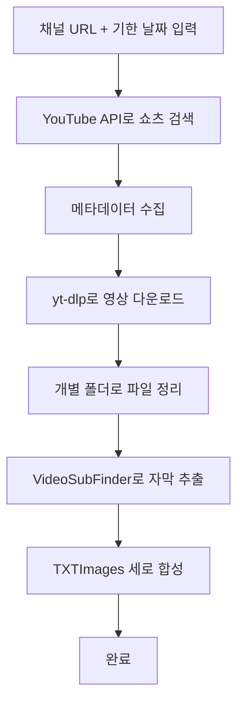

# 🎬 YouTube 쇼츠 다운로드 및 처리 프로그램

[](https://www.python.org/downloads/)
[](LICENSE)
[](#-보안-기능)

**완전 자동화된 YouTube 쇼츠 분석 시스템**으로, API 키 보안 관리 기능이 내장되어 있습니다.

## 🚀 주요 기능

### 📺 YouTube API 연동
- 채널 URL과 기한 날짜로 쇼츠 영상 자동 수집
- 메타데이터 완전 추출 (제목, 조회수, 좋아요, 댓글, 업로드 날짜)
- #shorts 태그와 60초 이하 duration으로 정확한 쇼츠 필터링

### ⬇️ 고품질 영상 다운로드
- **사용자 요청 형식 정확 구현**: `"bestvideo*[ext=mp4]+bestaudio[ext=m4a]/best[ext=mp4]/bestvideo*+bestaudio/best"`
- yt-dlp 라이브러리 직접 통합으로 안정성 극대화
- 다운로드 실패 시 자동 재시도 및 상세 로깅

### 📁 지능적 파일 관리
- 각 영상마다 제목 기반 개별 폴더 자동 생성
- Windows 호환 파일명 처리 (특수문자 제거, 경로 길이 제한)
- 다운로드된 영상을 해당 폴더로 자동 이동

### 🔤 자막 추출 자동화
- **VideoSubFinder 완벽 통합**: `-c -r -ccti -i [경로] -o [경로] -te 0.41`
- 모든 영상에 대해 일괄 자막 추출 수행
- 하드코딩된 자막 텍스트 이미지 생성

### 🖼️ 이미지 합성
- TXTImages 디렉토리의 모든 이미지를 세로로 합성
- PIL 라이브러리 활용한 고품질 이미지 처리
- 각 영상 폴더에 `[영상제목]_combined.png` 저장

### 🔒 **API 키 보안 관리**
- **.env 파일을 사용한 환경 변수 관리**
- **Git에서 API 키 완전 보호** (.gitignore 자동 설정)
- **python-dotenv**를 활용한 안전한 키 로딩
- **.env.example** 템플릿 파일 제공

---

## 🛠️ 설치 및 설정

### 자동 설치 (Windows)
```bash
install.bat
```

### 수동 설치
```bash
# 1. 패키지 설치
pip install -r requirements.txt

# 2. 환경 변수 파일 생성
cp .env.example .env

# 3. API 키 설정 (.env 파일 편집)
YOUTUBE_API_KEY=your_youtube_api_key_here
VIDEOSUBFINDER_PATH=C:\path\to\VideoSubFinderWXW.exe
BASE_DOWNLOAD_PATH=D:\your\download\path

# 4. 설정 확인
python config.py
```

---

## 🔑 YouTube API 키 발급

### 1. Google Cloud Console 설정
1. [Google Cloud Console](https://console.cloud.google.com/) 접속
2. 새 프로젝트 생성 또는 기존 프로젝트 선택
3. **API 및 서비스** → **라이브러리**에서 "YouTube Data API v3" 활성화

### 2. API 키 생성
1. **API 및 서비스** → **사용자 인증 정보** 선택
2. **+ 사용자 인증 정보 만들기** → **API 키** 선택
3. 생성된 API 키를 `.env` 파일에 추가

### 3. 보안 설정 (권장)
- **애플리케이션 제한사항**: HTTP 리퍼러 설정
- **API 제한사항**: YouTube Data API v3만 허용

📖 **상세한 API 키 설정 가이드**: [API_KEY_SECURITY_GUIDE.md](API_KEY_SECURITY_GUIDE.md)

---

## 💻 사용법

### 대화형 모드
```bash
python main.py
```

### 배치 모드
```bash
python main.py "https://www.youtube.com/@채널명" "2024-01-01"
```

### 디버그 모드
```bash
python main.py --debug
```

---

## 📁 생성되는 폴더 구조

프로그램 실행 후 다음과 같은 구조로 파일이 생성됩니다:

```
D:\youtube\인체백과\쇼츠 레퍼런스 분석\제목 강조형 템플릿\
└── [유튜브 채널 이름]\
    ├── [영상제목1]\
    │   ├── [영상제목1].mp4
    │   ├── ResultsDir\
    │   │   └── TXTImages\
    │   │       ├── image001.png
    │   │       ├── image002.png
    │   │       └── ...
    │   └── [영상제목1]_combined.png  # 합성된 이미지
    ├── [영상제목2]\
    └── ...
```

---

## 🔒 보안 기능

### ✅ 보안 강화 사항
- **환경 변수 사용**: API 키를 `.env` 파일에 안전하게 저장
- **Git 보호**: `.gitignore`에 `.env` 파일 자동 등록
- **템플릿 제공**: `.env.example`로 필요한 환경 변수 가이드
- **설정 검증**: 프로그램 시작 시 모든 설정 자동 검증

### 🚫 Git에서 제외되는 파일들
```gitignore
# 환경 변수 파일 (API 키 포함)
.env
.env.*

# 다운로드된 파일들 (선택적)
# *.mp4
# downloads/
```

### 📋 환경 변수 목록
| 변수명 | 설명 | 예시 |
|--------|------|------|
| `YOUTUBE_API_KEY` | YouTube Data API v3 키 | `AIzaSyD-9tSr...` |
| `VIDEOSUBFINDER_PATH` | VideoSubFinder 실행 파일 경로 | `C:\tools\VideoSubFinderWXW.exe` |
| `BASE_DOWNLOAD_PATH` | 다운로드 기본 경로 | `D:\youtube\downloads` |
| `DEBUG` | 디버그 모드 (선택) | `True` / `False` |
| `LOG_LEVEL` | 로그 레벨 (선택) | `INFO` / `DEBUG` |

---

## 🔧 문제 해결

### 자주 발생하는 문제

#### "API 키가 설정되지 않았습니다" 오류
```bash
❌ ValueError: YouTube API 키가 설정되지 않았습니다.
```
**해결:** `.env` 파일에 `YOUTUBE_API_KEY=실제_API_키` 추가

#### VideoSubFinder 경로 오류
```bash
❌ VideoSubFinder 디렉토리가 존재하지 않습니다
```
**해결:** `.env` 파일에서 `VIDEOSUBFINDER_PATH` 경로 확인 및 수정

#### Git에 .env 파일이 이미 커밋된 경우
```bash
git rm --cached .env
git add .
git commit -m "Remove .env from tracking"
git push
```

### 디버그 정보 확인
```bash
# 설정 상태 확인
python config.py

# 상세 로그와 함께 실행
python main.py --debug

# 로그 파일 확인
cat youtube_processor.log
```

---

## 📊 기술 스택

| 구분 | 기술 | 용도 |
|------|------|------|
| **API** | YouTube Data API v3 | 쇼츠 영상 정보 수집 |
| **다운로드** | yt-dlp | 고품질 영상 다운로드 |
| **자막 추출** | VideoSubFinderWXW | 하드코딩 자막 추출 |
| **이미지 처리** | Pillow (PIL) | 이미지 합성 |
| **보안** | python-dotenv | 환경 변수 관리 |
| **로깅** | Python logging | 상세 로그 기록 |

---

## 📈 처리 과정



---

## 🛡️ 보안 베스트 프랙티스

### ✅ 권장사항
- API 키를 `.env` 파일에만 저장
- 정기적인 API 키 갱신 (3-6개월)
- Google Cloud Console에서 API 사용량 모니터링
- 팀 작업 시 각자 API 키 발급

### ❌ 금지사항
- 코드에 API 키 하드코딩
- API 키를 채팅/이메일로 공유
- `.env` 파일을 Git에 커밋
- 공개 저장소에 API 키 노출

---

## 📝 라이선스

MIT License - 자유롭게 사용, 수정, 배포 가능합니다.

---

## 🤝 기여하기

1. Fork the Project
2. Create your Feature Branch (`git checkout -b feature/AmazingFeature`)
3. Commit your Changes (`git commit -m 'Add some AmazingFeature'`)
4. Push to the Branch (`git push origin feature/AmazingFeature`)
5. Open a Pull Request

**보안 관련 기여 시 주의사항:**
- API 키나 민감한 정보를 절대 커밋하지 마세요
- `.env.example` 파일만 수정하고 `.env` 파일은 건드리지 마세요

---

## 📞 지원

문제가 발생하면:
1. [API_KEY_SECURITY_GUIDE.md](API_KEY_SECURITY_GUIDE.md) 확인
2. `python config.py`로 설정 상태 점검
3. `--debug` 옵션으로 상세 정보 확인
4. GitHub Issues에 문제 보고

---

## 🎉 완료!

이제 **API 키가 완전히 보호된 상태**로 YouTube 쇼츠를 안전하게 분석할 수 있습니다!

```bash
python main.py
```

**Happy coding! 🚀**
